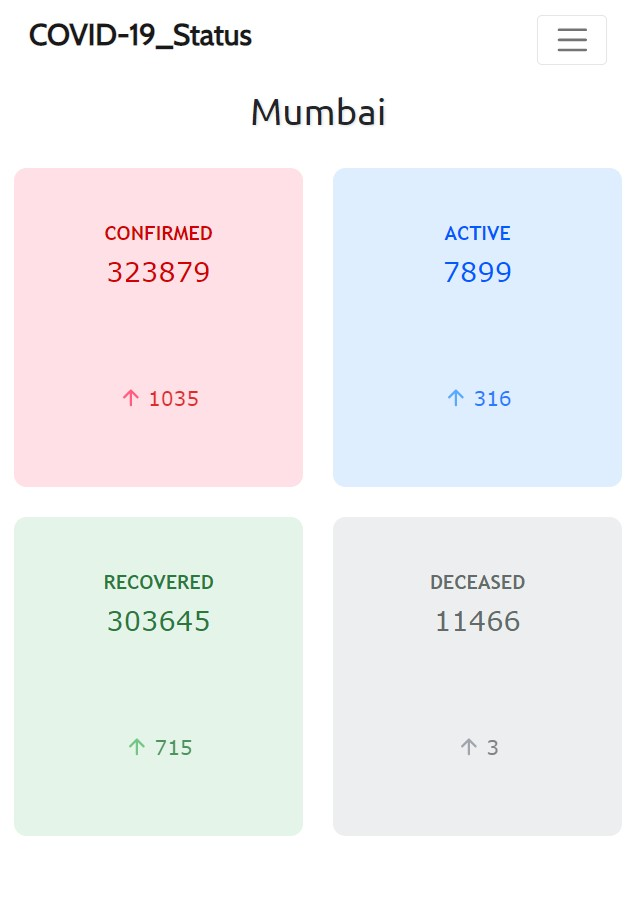
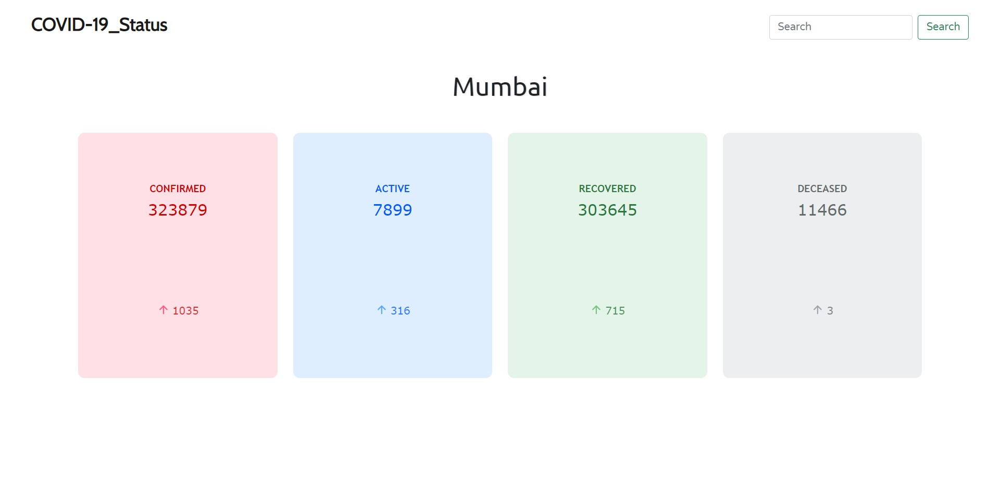

# COVID-19_Status

**This project shows the COVID-19 situation in India.**

>This script fetches data from <https://api.covid19india.org/state_district_wise.json>


## Steps to use

- Clone the repo to you machine
    ``` Python 
        git clone https://github.com/targusrock/COVID-19_Status.git
    ```

- Install the required libraries.
    ``` Python 
        pip install -r requirements.txt
    ```
  
  **Note:** The versions must match the requirements in order to
  properly function.

- Cd into the directory COVID-19_Status, and run the following code.
    ``` Python 
        python app.py
    ```

- The localserver will start and give you a link like
    ``` Python 
        * Running on http://127.0.0.1:5000/ (Press CTRL+C to quit)
    ```

    Click on the link if allowed or copy paste in your browser of choice.

And you are all set to view the data of your city.

## Mobile View
<p align="center">
  
</p>

## Desktop View
<p align="center">
  
</p>